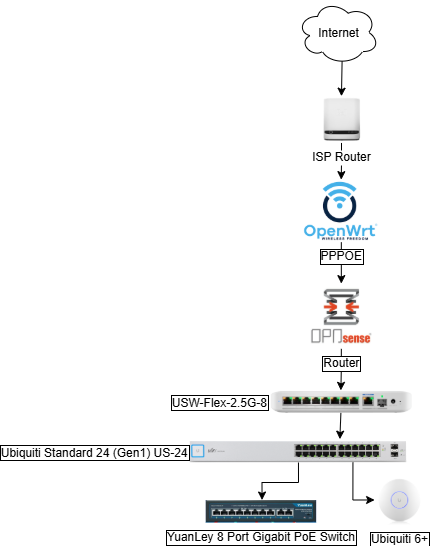

# Network Architecture

This document describes the network design of the homelab, including ISP connectivity, routing, switching, VLAN segmentation, and wireless access.

---

## ISP and Routing
- **ISP:** Bell 3 Gbps Fiber
- **Gateway:** OpenWRT VM (PPPoE termination on Bell Fiber)
- **Firewall/Router:** OPNsense VM
  - Manages VLANs, firewall rules, DHCP, DNS, and inter-VLAN routing
  - Provides primary gateway for all traffic
- **Failover:** Bell ISP router available as a backup if the OPNsense VM goes offline

---

## VLANs and Subnets
- **VLAN 5**: 192.168.5.0/24 – Trusted (PCs, laptops, phones)  
- **VLAN 15**: 192.168.15.0/24 – Servers (Proxmox nodes, TrueNAS, Plex)  
- **VLAN 25**: 192.168.25.0/24 – Media (TVs, consoles, Chromecast)  
- **VLAN 45**: 192.168.45.0/24 – IoT (ESP32, smart plugs, sensors)  
- **VLAN 70**: 192.168.70.0/24 – CCTV (Reolink cameras, NVRs)  
- **VLAN 99**: 192.168.99.0/24 – Management (Switches,APs) 
DHCP for all VLANs is managed by OPNsense.  

---

## Switching
- **USW-Flex-2.5G-8**  
  - Provides multi-gigabit connectivity to key devices (Proxmox Nodes, gaming PC)  
  - Uplink to OPNsense  

- **Ubiquiti Standard 24 (Gen1) US-24**  
  - Core distribution switch for 1 GbE devices  
  - Handles VLAN trunking and port assignments  

- **YuanLey 8-Port Gigabit PoE Switch**  
  - Provides PoE power for the UniFi 6+ AP and other PoE devices  

---

## Wireless
- **UniFi 6+ AP**  
  - Provides Wi-Fi coverage across multiple VLANs  
  - Each VLAN is assigned to its own SSID (not listed for privacy)  
  - WPA2/WPA3 authentication configured  

---

## Network Services
- **Pi-hole / AdGuard**: DNS filtering and ad blocking  
- **Tailscale**: Secure remote access and subnet routing  
- **Monit**: Network/service monitoring with email alerts  

---

## Diagram

